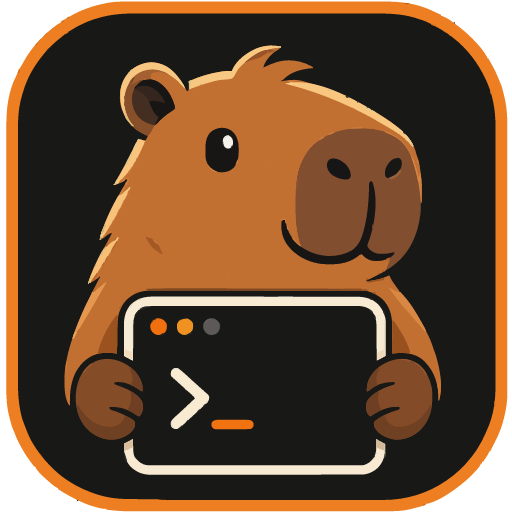
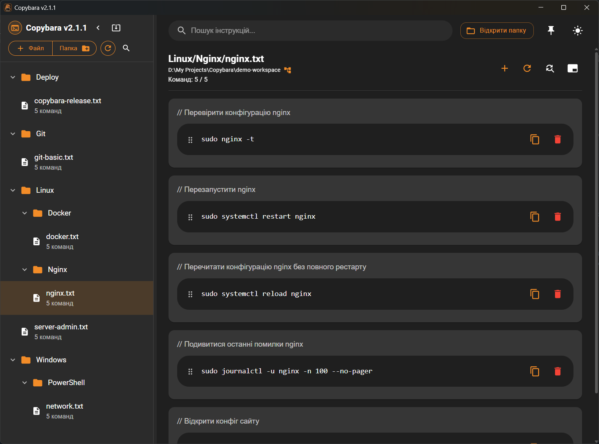
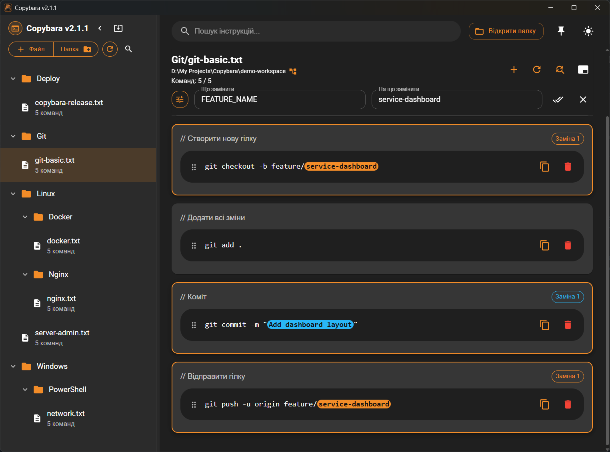
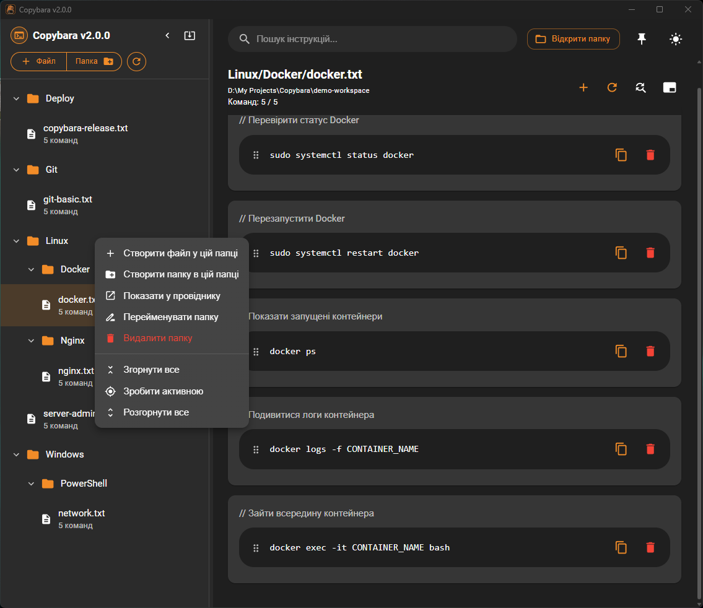
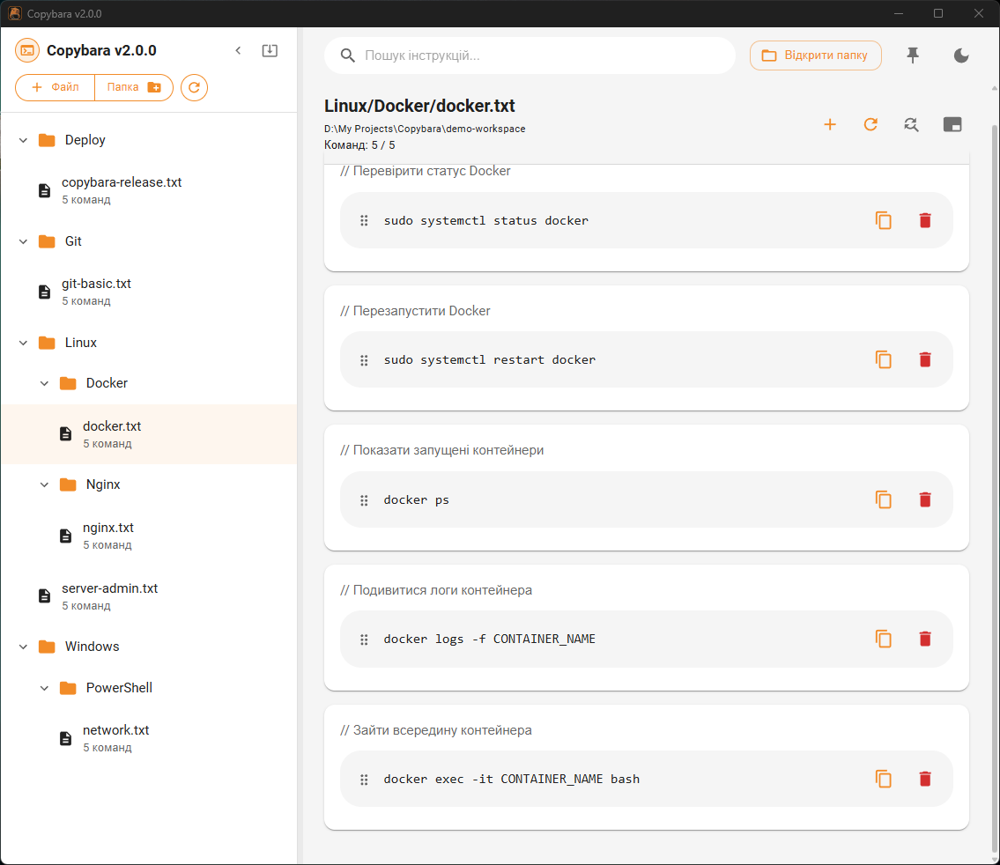

<h1>
  
  Copybara
</h1>

**Copybara** — це легкий desktop-застосунок для зберігання, організації та швидкого копіювання команд, інструкцій і текстових шаблонів.

Програма працює з простими `.txt` файлами у вибраній папці, тому твої дані залишаються звичайними файлами на диску: їх можна редагувати вручну, зберігати в Git, переносити між компʼютерами або синхронізувати будь-яким зручним способом.

<p align="center">
  
</p>

## Скріншоти

### Система замін

<p align="center">
  
</p>

### Дерево файлів і контекстне меню

<p align="center">
  
</p>

### Світла тема

<p align="center">
  
</p>

## Для чого це потрібно

Copybara зручна, коли часто доводиться використовувати однакові команди або текстові блоки:

* команди для Linux / Windows / Docker / Git;
* інструкції для адміністрування серверів;
* шаблони команд для розгортання сервісів;
* нотатки для проєктів;
* готові текстові фрагменти, які потрібно швидко копіювати.

Замість того щоб тримати десятки відкритих `.txt` файлів або шукати потрібну команду в історії термінала, можна відкрити робочу папку в Copybara й отримати зручний інтерфейс для роботи з ними.

---

## Основні можливості

### Робота з папками та файлами

* відкриття будь-якої локальної папки як робочого простору;
* автоматичне сканування вкладених папок;
* відображення дерева тільки з `.txt` файлами;
* створення нових файлів;
* створення нових папок;
* перейменування файлів і папок;
* видалення файлів і папок;
* відкриття елемента у провіднику / файловому менеджері;
* ручне перечитування файлу або всієї директорії;
* пошук по дереву папок і файлів із автоматичним розкриттям знайдених гілок;
* кнопка очищення пошуку прямо в полі введення;
* можливість швидко показати поточний файл у дереві та прокрутити його в центр видимої області;
* швидке згортання та розгортання всіх папок;
* дія **“Зробити активною”** для папки: вибрана гілка залишається розгорнутою, а інші папки згортаються.

---

### Організація команд

Кожен `.txt` файл може містити набір команд або текстових блоків.

Формат простий:

```txt
// Перезапуск nginx
sudo systemctl restart nginx

// Перевірка статусу nginx
sudo systemctl status nginx
```

Перший рядок, який починається з `//`, використовується як опис команди. Все, що йде нижче до наступного порожнього блоку, вважається текстом для копіювання.

Для великих шаблонів, у яких важливо зберегти порожні рядки, можна використовувати raw-блок між межами `---` або `===`:

```txt
// systemd service template
---
[Unit]
Description=My service

[Service]
ExecStart=/opt/my-app/my-app
Restart=always

[Install]
WantedBy=multi-user.target
---
```

Під час відображення та копіювання межі шаблону не потрапляють у текст команди, але порожні рядки всередині зберігаються. Якщо команда містить порожні рядки, Copybara автоматично обгортає її в `---` під час збереження.

Також можна зберігати блоки без опису.

---

### Копіювання в один клік

* кожна команда відображається окремою карткою;
* текст можна скопіювати однією кнопкою;
* після копіювання команда підсвічується;
* можна увімкнути режим автоматичного згортання вікна після копіювання;
* перед копіюванням можуть автоматично застосовуватися всі активні правила заміни.

Це зручно, коли Copybara використовується як швидка панель команд поруч із терміналом, браузером або RDP-сесією.

---

### Пошук і заміна

Copybara має вбудований пошук по поточному файлу:

* пошук по опису;
* пошук по тексту команди;
* миттєва фільтрація списку команд;
* `Ctrl + F` переводить фокус у пошук Copybara замість стандартного пошуку WebView;
* якщо перед `Ctrl + F` виділено текст, він автоматично вставляється в поле пошуку.

Окремо доступний пошук по дереву папок і файлів:

* пошук по назві папки, назві файлу та повному шляху;
* знайдені вкладені файли показуються разом із батьківськими папками;
* під час активного пошуку потрібні гілки дерева розкриваються автоматично;
* поле пошуку можна сховати кнопкою, при цьому текст зберігається, але фільтр не застосовується;
* пошук можна очистити кнопкою всередині поля введення.

Copybara також підтримує систему замін перед копіюванням. Наприклад, можна зберігати шаблон з `SERVER_NAME`, `IP_ADDRESS` або `SERVICE_NAME`, а перед копіюванням швидко підставляти потрібні значення.

Можливості замін:

* підтримка кількох правил заміни одночасно;
* окреме діалогове вікно для керування списком замін;
* компактна кнопка керування списком замін у панелі поточного файлу;
* перше правило заміни використовує основний помаранчевий колір Copybara;
* додаткові правила автоматично отримують окремі яскраві кольори;
* усі активні заміни підсвічуються в командах різними кольорами;
* при копіюванні команди всі активні заміни застосовуються послідовно;
* `Ctrl + R` відкриває або закриває панель заміни;
* якщо перед `Ctrl + R` виділено текст, він автоматично вставляється в перше правило заміни.

---

### Редагування прямо в програмі

У Copybara можна редагувати `.txt` файли без відкриття окремого редактора:

* додавати нові команди;
* редагувати опис;
* редагувати текст команди;
* зручно зберігати багаторядкові шаблони конфігурацій із порожніми рядками;
* видаляти команди;
* змінювати порядок команд drag-and-drop перетягуванням;
* виділяти слова в тексті команди подвійним кліком без випадкового переходу в режим редагування;
* відкривати редагування команди через правий клік по тексту команди.

Усі зміни записуються назад у звичайний `.txt` файл.

---

### Зручний інтерфейс

* темна та світла тема;
* помаранчевий акцентний колір;
* змінна ширина панелі дерева;
* можливість сховати дерево файлів;
* кнопка “Показати в дереві” біля поточного файлу;
* компактні кнопки керування файлом, замінами, пошуком і оновленням;
* режим “поверх інших вікон”;
* контекстне меню для файлів і папок;
* вимкнене стандартне контекстне меню WebView там, де воно заважає роботі;
* мінімальний розмір вікна, щоб інтерфейс не стискався до зламаного стану;
* гарячі клавіші для швидких дій.

---

## Гарячі клавіші

| Комбінація         | Дія                                                                 |
| ------------------ | ------------------------------------------------------------------- |
| `Ctrl + F`         | Перейти в пошук Copybara                                            |
| `Ctrl + R`         | Відкрити або закрити панель заміни                                  |
| `Ctrl + +`         | Відкрити вікно додавання команди                                    |
| `Ctrl + Shift + +` | Створити новий файл                                                 |
| `Ctrl + Enter`     | Додати команду з відкритого діалогу                                 |

> Якщо перед `Ctrl + F` або `Ctrl + R` виділено текст, Copybara автоматично підставить його у відповідне поле.

---

## Платформи

Copybara — це desktop-застосунок на базі **Tauri + React + TypeScript + MUI**.

Підтримуються релізи для:

* **Windows** — інсталятор `.exe`;
* **Linux** — пакет `.deb`.

Релізи публікуються через GitHub Releases:
https://github.com/Synterius/copybara-releases/releases

---

## Оновлення

Copybara має вбудовану перевірку оновлень.

У програмі є кнопка перевірки оновлень. Якщо доступна нова версія, Copybara запропонує завантажити та встановити її.

Оновлення використовують підписані артефакти Tauri updater.

---

## Як зберігаються дані

Copybara не використовує власну базу даних для команд.

Усе зберігається у звичайних `.txt` файлах у вибраній користувачем папці.

Приклад структури:

```txt
commands/
├── linux/
│   ├── docker.txt
│   ├── nginx.txt
│   └── systemd.txt
├── windows/
│   ├── powershell.txt
│   └── network.txt
└── git.txt
```

Такий підхід має кілька переваг:

* файли легко читати без Copybara;
* можна зберігати робочу папку в Git;
* можна синхронізувати через будь-який cloud/storage;
* легко переносити між Windows і Linux;
* немає привʼязки до конкретного формату бази даних.

---

## Приклад `.txt` файлу

```txt
// Перевірити статус сервісу
sudo systemctl status nginx

// Перезапустити сервіс
sudo systemctl restart nginx

// Подивитися останні логи
journalctl -u nginx -n 100 --no-pager

// Перевірити конфігурацію nginx
sudo nginx -t

// Шаблон systemd service
---
[Unit]
Description=Example service

[Service]
ExecStart=/opt/example/example
Restart=always

[Install]
WantedBy=multi-user.target
---
```

У Copybara кожен блок буде показаний як окрема команда з кнопкою копіювання. Для raw-блоків межі `---` не копіюються, але порожні рядки всередині шаблону зберігаються.

---

## Що нового в Copybara 2.1.0

Copybara 2.1.0 — реліз із покращеннями навігації по дереву та підтримкою зручного збереження багаторядкових шаблонів.

### Нове

* Додано raw-блоки між `---` або `===` для шаблонів, у яких потрібно зберігати порожні рядки.
* Команди з порожніми рядками автоматично обгортаються в `---` під час збереження.
* Додано кнопку **“Показати в дереві”** біля поточного файлу.
* Кнопка відкриває потрібні батьківські папки та прокручує дерево до вибраного файлу.
* Додано пошук по дереву папок і файлів.
* Додано кнопку показу/приховування поля пошуку по дереву.
* Додано кнопку очищення пошуку прямо в полі введення.

### Покращення UX

* Пошук по дереву не стирає введений текст при приховуванні поля, але тимчасово вимикає фільтр.
* Під час пошуку знайдені вкладені файли показуються разом із батьківськими папками.
* Під час активного пошуку дерево автоматично розкриває знайдені гілки.
* Кнопки згортання панелі та перечитування директорії залишаються біля лівої частини заголовка й не “їдуть” при розширенні панелі дерева.

---

## Що нового в Copybara 2.0.0

Copybara 2.0.0 — великий реліз із новою системою замін, покращеннями навігації та суттєвим внутрішнім рефакторингом.

### Нове

* Додано підтримку кількох замін одночасно.
* Додано окреме діалогове вікно для керування списком замін.
* Перше правило заміни використовує основний помаранчевий колір Copybara.
* Додаткові правила заміни автоматично отримують окремі яскраві кольори.
* Підсвітка команд тепер показує всі активні заміни різними кольорами.
* При копіюванні команди всі активні заміни застосовуються послідовно.
* Додано компактну кнопку керування списком замін у панелі поточного файлу.

### Покращення UX

* `Ctrl + F` переводить фокус у пошук Copybara замість стандартного пошуку WebView.
* Якщо перед `Ctrl + F` виділено текст, він автоматично вставляється в поле пошуку.
* `Ctrl + R` відкриває або закриває панель заміни.
* Якщо перед `Ctrl + R` виділено текст, він автоматично вставляється в перше правило заміни.
* Подвійний клік по команді дозволяє нормально виділяти слово.
* Редагування команди перенесено на правий клік по тексту команди.
* Додано мінімальний розмір вікна, щоб інтерфейс не стискався до зламаного стану.

### Дерево файлів і папок

* Додано дію **“Зробити активною”** для папок у контекстному меню.
* Активна папка розгортається, а інші папки згортаються.
* Покращено контекстне меню файлів і папок.
* Збережено зручні дії для створення, перейменування, видалення, відкриття й показу у провіднику.

### Архітектура

* Значно зменшено розмір `App.tsx`.
* Винесено типи, утиліти, сервіси й UI-компоненти в окремі файли.
* Додано окремі компоненти для панелі замін, діалогу правил заміни, діалогів створення, перейменування, підтвердження, оновлення, верхньої панелі, дерева файлів, контекстного меню, картки команди, підсвітки замін та екранів стану workspace.

### Технічне

* `npm run build` проходить без помилок.
* Підготовлено основу для подальшого розвитку Copybara без перевантаження головного компонента.

---

## Розробка

### Встановлення залежностей

```bash
npm install
```

### Запуск у dev-режимі

```bash
npm run tauri dev
```

### Production build

```bash
npm run tauri build
```

---

## Технології

* Tauri 2
* React
* TypeScript
* Material UI
* Vite
* Rust

---

## Ідея проєкту

Copybara створена як проста заміна звʼязки “провідник + блокнот” для людей, які постійно працюють з командами, інструкціями та повторюваними текстовими блоками.

Головна ідея — залишити простоту `.txt` файлів, але додати зручний інтерфейс для швидкої роботи з ними.

---

## License

Copybara is released under the MIT License.

You are free to use, modify and distribute this software, provided that the original copyright notice and license text are included.

See [LICENSE](./LICENSE) for details.